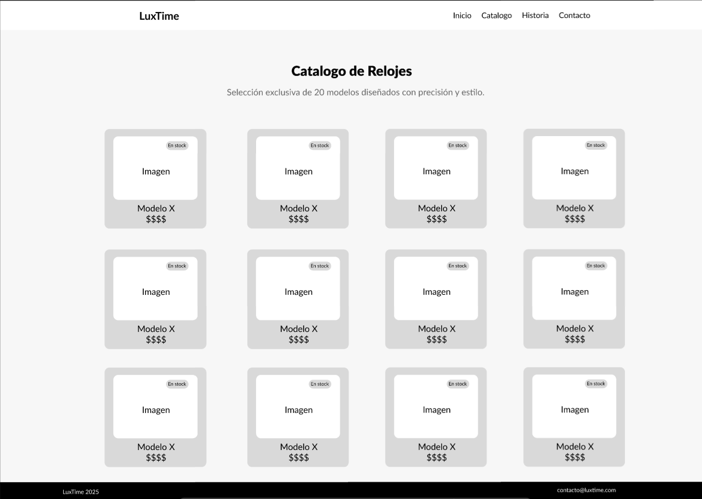
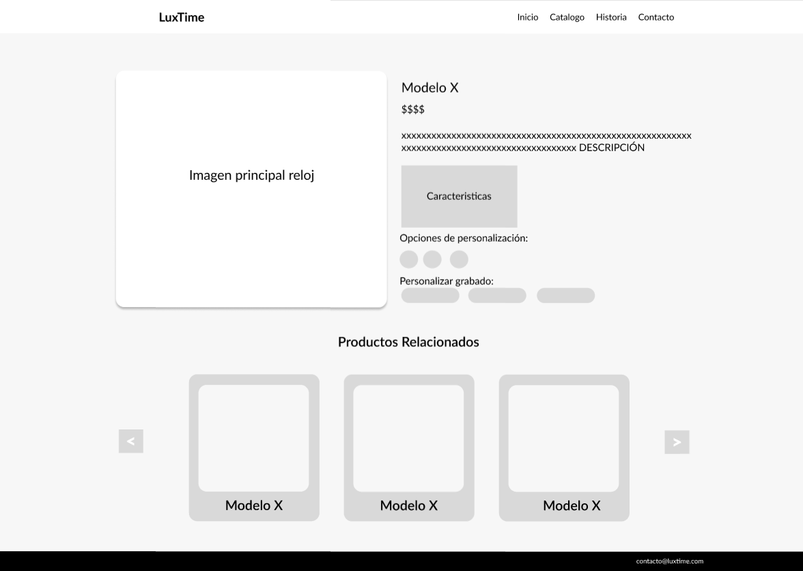
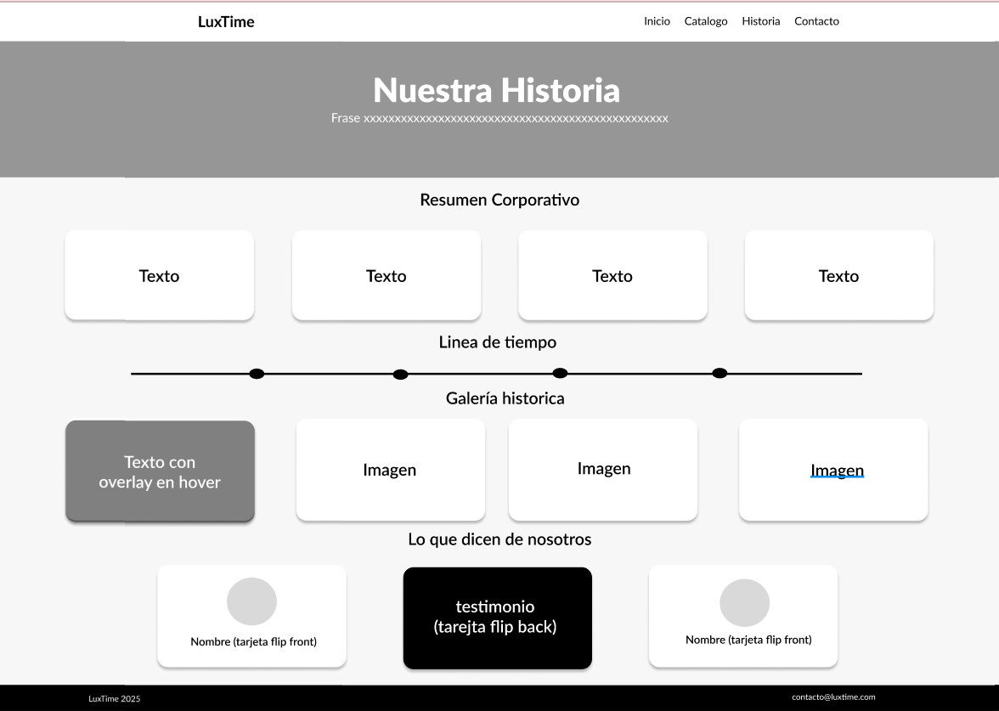
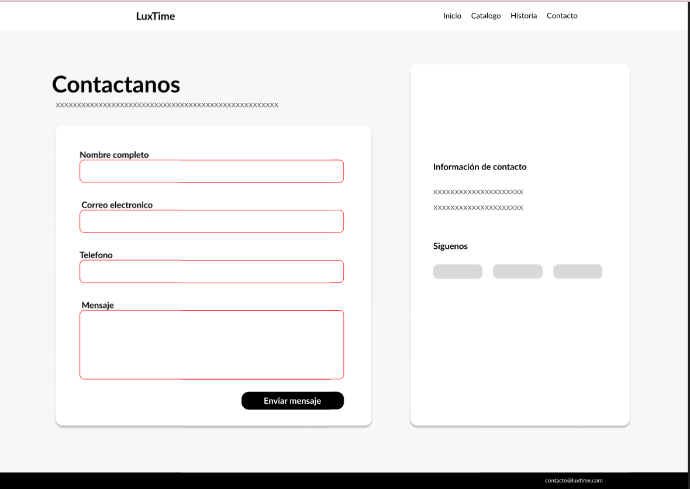

# LuxTime - Maqueta Web Corporativa

Este repositorio contiene la maqueta estática para el sitio web corporativo de **LuxTime**, una marca de relojes de autor. El proyecto ha sido desarrollado exclusivamente con **HTML5 y CSS3 nativo**, sin el uso de librerías o frameworks externos, con el objetivo de demostrar habilidades en maquetación, diseño responsive y simulación de interacciones avanzadas mediante CSS.

## 🌐 Demo en Vivo

Puedes ver la maqueta desplegada en el siguiente enlace:

[**Ver LuxTime en vivo**](https://luxtimeblog.netlify.app/) 

## Contexto del Proyecto

La empresa LuxTime encargó el diseño de su sitio web corporativo para reflejar su identidad de marca, que combina la artesanía tradicional con un diseño atemporal. El entregable es una maqueta visual y funcional (sin backend) que abarca las principales secciones y funcionalidades del sitio, sirviendo como un prototipo de alta fidelidad antes de la fase de desarrollo completo.

---

El enfoque principal se centró en:

- **Planificación y Diseño UI/UX:** Basado en wireframes detallados para asegurar una experiencia de usuario intuitiva.
- **Maquetación Semántica:** Uso de HTML5 para una estructura clara y accesible.
- **Estilo y Animaciones con CSS:** Implementación de un diseño responsive y componentes interactivos simulados (carruseles, filtros visuales, etc.) únicamente con CSS.
- **Responsive Design:** Adaptabilidad a múltiples dispositivos (móvil, tablet y escritorio) utilizando Media Queries.

## 🎨 Wireframes

La planificación visual del proyecto se basó en los siguientes wireframes, que definieron la estructura y la experiencia de usuario para cada página clave.

| Página | Wireframe |
| :--- | :--- |
| **Página de Inicio** |  |
| **Catálogo** |  |
| **Detalle de Producto** |  |
| **Historia** |  |
| **Contacto** |  |

---

## ✨ Características Implementadas

El sitio web está compuesto por las siguientes páginas y funcionalidades clave:

### 1. Página de Inicio (`index.html`)
- **Banner Principal (Hero Section):**
  - Un banner destacado con texto superpuesto y un botón de llamada a la acción.
  - **Simulación de carrusel automático** con 3 imágenes de fondo que rotan mediante animaciones CSS (`@keyframes`).
- **Relojes Destacados:**
  - Una sección con 6 tarjetas de productos que incluyen imagen, nombre, precio, rating de estrellas y un enlace a la página de detalle.
- **Resumen de la Historia:**
  - Breve introducción a la misión, visión y valores de la empresa.
  - **Línea de tiempo interactiva** que revela información de hitos al pasar el cursor (`:hover`).
  - Inclusión de un video corporativo.
- **Testimonios:**
  - Un carrusel de testimonios que rota automáticamente con un efecto de fundido (fade) implementado con animaciones CSS.

### 2. Catálogo de Relojes (`/pages/catalogo.html`)
- **Grid de Productos:**
  - Muestra de 20 modelos en un grid responsive.
  - Cada tarjeta de producto incluye imagen, nombre, precio y una **etiqueta de disponibilidad** (`En stock` o `Agotado`) con estilos distintivos.

### 3. Detalle del Producto (`/pages/detalle-a001.html`)
- **Visor de Producto:**
  - Imagen principal del reloj con un sutil **efecto de zoom** al pasar el cursor.
- **Personalización Simulada (CSS-only):**
  - **Selector de color:** Permite cambiar la imagen principal del reloj al seleccionar una de las opciones de color, utilizando selectores de CSS (`:checked` y `~`).
  - **Selector de grabado:** Muestra un texto personalizado sobre la imagen del reloj según la opción seleccionada.
- **Carrusel de Productos Relacionados:**
  - Un carrusel horizontal 100% funcional con CSS que permite navegar entre dos grupos de productos relacionados.

### 4. Historia de la Empresa (`/pages/historia.html`)
- **Línea de Tiempo Interactiva:**
  - Una línea de tiempo horizontal que muestra hitos clave. Al pasar el cursor sobre un año, se despliega una "burbuja" con más detalles e una imagen.
- **Galería Histórica:**
  - Una galería de imágenes en formato de mosaico (grid) que revela información superpuesta al interactuar con cada elemento.
- **Testimonios con Efecto Flip:**
  - Tarjetas de testimonios que giran 180 grados (`transform: rotateY(180deg)`) al pasar el cursor para mostrar el texto del testimonio en el reverso.

### 5. Página de Contacto (`/pages/contacto.html`)
- **Formulario de Contacto:**
  - Campos para nombre, correo, teléfono y mensaje.
  - **Validación visual nativa con CSS:** Los campos cambian de estilo para indicar si la entrada es válida o no, utilizando las pseudoclases `:valid` e `:invalid`. Se muestran mensajes de error contextuales.
- **Información Adicional:**
  - Datos de contacto directo (email y teléfono).
  - Enlaces a redes sociales.

### 6. Componentes Globales
- **Header y Navegación:**
  - Un encabezado fijo (`position: sticky`) para una navegación accesible en todo momento.
- **Menú de hamburguesa** funcional en dispositivos móviles, controlado completamente con CSS (utilizando un checkbox oculto).
- **Footer:**
  - Un pie de página consistente en todo el sitio, maquetado con **Flexbox** para una alineación y distribución correctas.

## 🛠️ Tecnologías Utilizadas

- **HTML5:** Para una estructura semántica, limpia y accesible.
- **CSS3:** Para todo el estilizado, diseño responsive, animaciones y simulación de interacciones.
  - **Flexbox y Grid Layout:** Para la maquetación moderna y robusta de las secciones.
  - **Media Queries:** Para garantizar una experiencia óptima en al menos 3 breakpoints (móvil, tablet, escritorio).
  - **Animaciones y Transiciones:** Para efectos visuales fluidos y atractivos.
  - **Pseudoclases y Selectores Avanzados:** Para simular interactividad sin necesidad de JavaScript (`:hover`, `:checked`, `~`, `:has`).

---

## 📂 Estructura del Proyecto

El repositorio está organizado de la siguiente manera para mantener el código ordenado y escalable:

```
luxtime/
├── css/
│   ├── catalogo.css
│   ├── contacto.css
│   ├── detalle.css
│   ├── historia.css
│   └── styles.css         # Estilos de la página de inicio
├── images/                # Imágenes de productos, banners y recursos
├── pages/
│   ├── catalogo.html
│   ├── contacto.html
│   ├── detalle-a001.html
│   ├── detalle-b002.html
│   ├── detalle-c001.html
│   ├── detalle-d003.html
│   ├── detalle-e001.html
│   ├── detalle-a004.html
│   └── historia.html
├── videos/
│   └── video.mp4
├── index.html             # Página de inicio
└── README.md              # Documentación del proyecto
```

---

## 🚀 Cómo Empezar

Dado que es un proyecto estático, no se requiere ninguna instalación especial.

1. Clona el repositorio en tu máquina local:
   ```bash
   git clone <URL-del-repositorio>
   ```
2. Navega al directorio del proyecto:
   ```bash
   cd luxtime
   ```
3. Abre el archivo `index.html` en tu navegador web preferido.

---

## 👨‍💻 Autor

Este proyecto fue desarrollado como parte de un desafío de maquetación web.

- **Nombre:** Paula Andrea Viviescas Jaimes / Sebastian Andrea Mora Valenzuela
- **GitHub:** PaulaV09 / Smora1110
